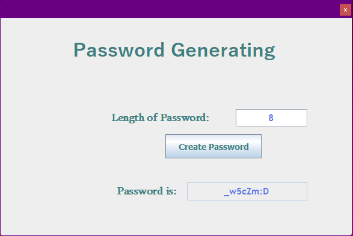
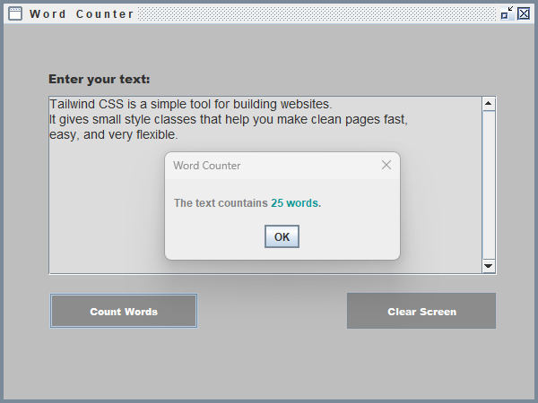

# GUI Code Samples

A collection of small, self-contained Java desktop GUI applications, built as practice/portfolio projects using **Swing** and **JavaFX**. Each subfolder is an independent project with its own source code and can be opened and run on its own in an IDE (VS Code, IntelliJ IDEA, Eclipse).

---

## Screenshots

### Password Generator



### Word Counter



### IP Address Finder


### Widgets Collection – Variant 1 (colored buttons)


### Widgets Collection – Variant 2 (icon buttons)


---

## Projects Overview

| Project                                                 | GUI Toolkit          | Entry Point                                                                   | Description                                                     |
| ------------------------------------------------------- | -------------------- | ----------------------------------------------------------------------------- | --------------------------------------------------------------- |
| [PasswordGeneratingGui](#1-passwordgeneratinggui-swing) | Swing                | `net.bits_and_bytes.passwordGenerating.PasswordGeneratorMain`                 | Generates a random password of a user-defined length            |
| [WordCounter](#2-wordcounter-swing)                     | Swing                | `WordCounter`                                                                 | Counts the number of words in a block of text                   |
| [IpAddressFinderFXGui](#3-ipaddressfinderfxgui-javafx)  | JavaFX (+ FXML, CSS) | `application.Main`                                                            | Resolves the IP address for a URL entered by the user           |
| [WidgetsCollection](#4-widgetscollection-javafx)        | JavaFX               | `widgetVariant1.WidgetWebsiteStarter` / `widgetVariant2.WidgetWebsiteStarter` | A small floating desktop widget with buttons that open websites |

---

## 1. PasswordGeneratingGui (Swing)

Generates a random password based on a length specified by the user.

- **Files**: `src/net/bits_and_bytes/passwordGenerating/PasswordGeneratorMain.java` (entry point), `PasswordGeneratorGUI.java` (Swing UI, custom-styled `JFrame` with absolute layout, custom fonts/colors, checkmark and dice icons), `PasswordCreator.java` (password-generation logic)
- **How it works**: The user enters a desired password length into a text field and clicks the "Create Password" button; `PasswordCreator` validates the length and randomly generates a password, which is then displayed in a read-only result field.
- **Also included**: A pre-built, ready-to-run `GeneratePassword.jar` — no IDE required, just run `java -jar GeneratePassword.jar` (with Java installed).
- **GUI toolkit**: Swing (`javax.swing`, `java.awt`).

---

## 2. WordCounter (Swing)

Counts the words entered by the user in a text area (numbers are counted as words).

- **Files**: `src/WordCounter.java` — a single, self-contained class combining the UI and logic
- **How it works**: The user types or pastes text into a scrollable `JTextArea`. Clicking **"Count Words"** splits the text on non-word characters (`countWords()` via a regular expression) and shows the total word count in a popup dialog (`JOptionPane`). Clicking **"Clear Screen"** empties the text area.
- **UI style**: Undecorated custom window (`setUndecorated(true)`) with a grey color scheme and bold custom fonts.
- **GUI toolkit**: Swing.

---

## 3. IpAddressFinderFXGui (JavaFX)

Finds the IP address for a URL entered by the user.

- **Files**: `src/application/Main.java` (entry point, loads the FXML layout), `Controller.java` (button click handlers), `application.fxml` (the `GridPane`-based layout: URL input field, "Find IP Address" button, result label, and a cancel button), `styles.css` (styling)
- **How it works**: The user types a URL into the input field and clicks **"Find IP Address"**; the controller resolves the hostname to an IP address (via `java.net.InetAddress`) and displays it next to the "IP Address is:" label. A dedicated cancel button (styled via CSS) closes the window.
- **Window style**: Transparent, undecorated stage (`StageStyle.TRANSPARENT`) positioned at fixed screen coordinates.
- **GUI toolkit**: **JavaFX**.

---

## 4. WidgetsCollection (JavaFX)

A small always-visible desktop widget with buttons that open websites in the default browser, available in two visual variants:

- **`widgetVariant1/WidgetWebsiteStarter.java`** – Five plain, CSS-styled buttons (`styles.css` defines `.btnOne` … `.btnFive`) arranged vertically in a `VBox`.
- **`widgetVariant2/WidgetWebsiteStarter.java`** – The same idea, but each button uses an icon image (GitHub, Wikimedia Commons, Wikibooks, Java mascot, and a close/cancel icon) with a reflection effect, laid out with `Group`/absolute positioning and sized to fit the visible screen bounds (`Screen.getPrimary().getVisualBounds()`).
- **How it works**: Each button's click handler calls `getHostServices().showDocument(url)` to open a specific website (GitHub, Wikimedia Commons, Wikibooks, the Java docs) in the system's default browser.
- **GUI toolkit**: **JavaFX**.

---

## Getting Started

### Prerequisites

- **JDK 8 or higher** installed (`java -version` / `javac -version` to check)
- An IDE such as **IntelliJ IDEA**, **VS Code** (with the "Extension Pack for Java"), or **Eclipse**
- For the JavaFX projects only: the **JavaFX SDK**, or the JavaFX libraries resolved via Maven

### Running the Swing Projects (PasswordGeneratingGui, WordCounter)

Swing is part of the standard JDK, so no extra setup is required:

1. Open the respective project subfolder (e.g. `PasswordGeneratingGui`) in your IDE.
2. Open the file containing the `main` method (`PasswordGeneratorMain.java` or `WordCounter.java`).
3. Click the "Run" ▶️ button next to `main` (VS Code / IntelliJ), or run it from the terminal:
   ```bash
   javac -d out src/**/*.java
   java -cp out <fully-qualified-main-class>
   ```
4. Alternatively, for `PasswordGeneratingGui`, simply run the included jar:
   ```bash
   java -jar PasswordGeneratingGui/GeneratePassword.jar
   ```

### Running the JavaFX Projects (IpAddressFinderFXGui, WidgetsCollection)

JavaFX is no longer bundled with the JDK (since Java 11), so it needs to be added as a dependency and enabled at runtime:

1. **Add the JavaFX libraries** to your project:
   - **IntelliJ IDEA**: `File → Project Structure → Libraries → + → From Maven...`, then add `org.openjfx:javafx-controls:21` and `org.openjfx:javafx-fxml:21` (adjust the version to your JDK).
   - **VS Code / manual setup**: download the JavaFX SDK from https://gluonhq.com/products/javafx/ and reference its `lib` folder.
2. **Set the required VM options** in your run configuration:
   ```
   --add-modules javafx.controls,javafx.fxml
   ```
   If the JavaFX jars are on the classpath rather than a module path (e.g. when resolved via Maven in IntelliJ), also add `--module-path` pointing to the folders containing the JavaFX jars, for example:
   ```
   --module-path "<path-to>\javafx-controls\21;<path-to>\javafx-graphics\21;<path-to>\javafx-base\21;<path-to>\javafx-fxml\21" --add-modules javafx.controls,javafx.fxml
   ```
3. Run the class containing `public static void main` that calls `launch(args)` (`application.Main` for the IP Finder, or either `WidgetWebsiteStarter` class for the Widgets Collection).

---

## Project Structure

```bash
GUI-code-samples/
├── docs/
│   └── screenshots/                          # README screenshots
├── PasswordGeneratingGui/
│   ├── GeneratePassword.jar                    # Pre-built runnable jar
│   └── src/net/bits_and_bytes/passwordGenerating/
│       ├── PasswordGeneratorMain.java             # Entry point
│       ├── PasswordGeneratorGUI.java              # Swing UI
│       ├── PasswordCreator.java                   # Password generation logic
│       └── images/                                # checkmark.gif, dices.png
├── WordCounter/
│   └── src/WordCounter.java                      # Entry point + UI + logic in one file
├── IpAddressFinderFXGui/
│   └── src/
│       ├── application/
│       │   ├── Main.java                          # Entry point, loads application.fxml
│       │   ├── Controller.java                     # Button click handlers
│       │   ├── application.fxml                    # FXML layout
│       │   └── styles.css                          # Styling
│       └── images/close.png
├── WidgetsCollection/
│   └── src/
│       ├── widgetVariant1/
│       │   ├── WidgetWebsiteStarter.java            # Entry point, plain buttons
│       │   └── styles.css
│       ├── widgetVariant2/
│       │   └── WidgetWebsiteStarter.java            # Entry point, icon buttons + reflection
│       └── images/                                  # github-*.png, wikimedia-*.png, wikibooks-logo.png, java-mascot.png, black-board-5.png, red-cancel-btn.png
└── README.md
```
